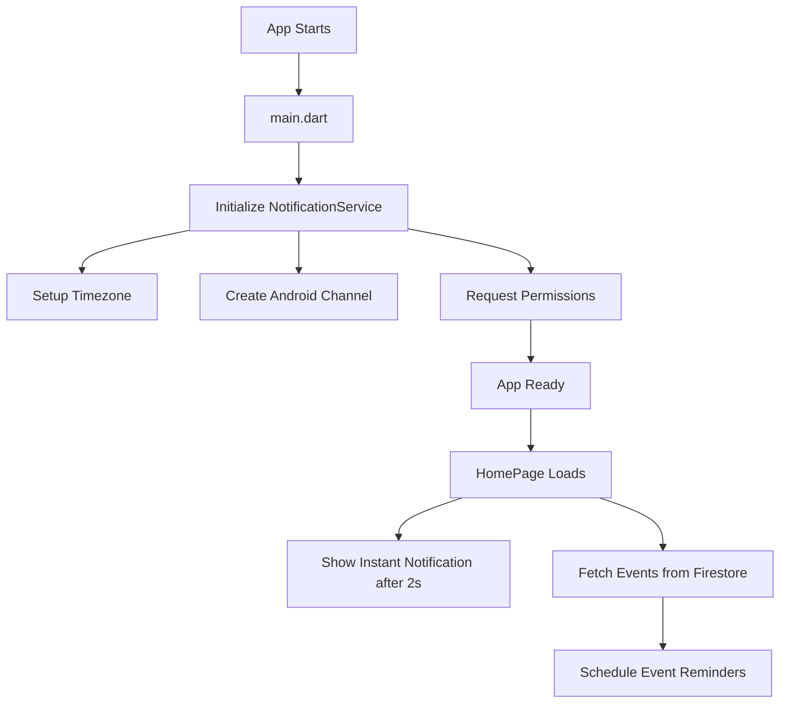

# UEO App - Notification System Documentation

## 📋 Table of Contents
1. [Overview](#overview)
2. [Architecture](#architecture)
3. [Dependencies & Configuration](#dependencies--configuration)
4. [Implementation Details](#implementation-details)
5. [How It Works](#how-it-works)
6. [System Status & Analysis](#system-status--analysis)
7. [Testing & Verification](#testing--verification)
8. [Recommendations](#recommendations)

---

## Overview

The UEO App implements a **local notification system** using Flutter's `flutter_local_notifications` plugin along with Firebase Messaging support. The system is designed to:

- Send instant notifications to users
- Schedule event reminder notifications (2 days before events)
- Handle timezone-aware scheduling
- Support Android platform with proper permissions

### Key Features
✅ **Instant Notifications** - Show immediate notifications for testing  
✅ **Scheduled Notifications** - Schedule event reminders based on event dates  
✅ **Timezone Support** - Proper timezone handling for accurate scheduling  
✅ **Android Support** - Full Android implementation with required permissions  
⚠️ **iOS Support** - Dependencies present but implementation incomplete  

---

## Architecture

### Design Pattern
The notification system follows the **Singleton Pattern** to ensure a single instance manages all notifications throughout the app lifecycle.

```dart
class NotificationService {
  static final NotificationService _instance = NotificationService._internal();
  factory NotificationService() => _instance;
  NotificationService._internal();
}
```

### Component Structure

```
UEO App
├── main.dart (Initialization)
├── notification_service.dart (Core Service)
└── HomePage.dart (Usage & Scheduling)
```

---

## Dependencies & Configuration

### 1. **Dependencies** ([pubspec.yaml](file:///c:/Users/waqas/StudioProjects/UEO_App/pubspec.yaml))

```yaml
dependencies:
  flutter_local_notifications: ^17.2.2  # Local notification handling
  firebase_messaging: ^16.1.0           # Firebase Cloud Messaging (FCM)
  timezone: ^0.9.2                       # Timezone-aware scheduling
```

**Purpose:**
- `flutter_local_notifications` - Handles local notification creation and scheduling
- `firebase_messaging` - Enables push notifications from Firebase (for future use)
- `timezone` - Manages timezone conversions for accurate scheduling

### 2. **Android Configuration** ([AndroidManifest.xml](file:///c:/Users/waqas/StudioProjects/UEO_App/android/app/src/main/AndroidManifest.xml))

```xml
<!-- Notification Permissions -->
<uses-permission android:name="android.permission.POST_NOTIFICATIONS"/>
<uses-permission android:name="android.permission.RECEIVE_BOOT_COMPLETED"/>
<uses-permission android:name="android.permission.SCHEDULE_EXACT_ALARM" />
<uses-permission android:name="android.permission.USE_EXACT_ALARM" />
```

**Permission Breakdown:**
- `POST_NOTIFICATIONS` - Required for Android 13+ to display notifications
- `RECEIVE_BOOT_COMPLETED` - Allows notifications to persist after device reboot
- `SCHEDULE_EXACT_ALARM` - Enables precise scheduling of notifications
- `USE_EXACT_ALARM` - Alternative permission for exact alarms

### 3. **Notification Channel**

Android requires notification channels for organizing notifications:

```dart
static const AndroidNotificationChannel _eventChannel = AndroidNotificationChannel(
  'event_channel_id',           // Unique channel ID
  'Event Notifications',         // User-visible name
  description: 'Notifications for upcoming events',
  importance: Importance.max,    // High priority
);
```

---

## Implementation Details

### 1. **Initialization Flow** ([main.dart](file:///c:/Users/waqas/StudioProjects/UEO_App/lib/main.dart#L39-L40))

```dart
void main() async {
  WidgetsFlutterBinding.ensureInitialized();
  
  // 1. Load Environment Variables
  await dotenv.load(fileName: ".env");
  
  // 2. Initialize Stripe
  Stripe.publishableKey = dotenv.env['stripePublishablekey'] ?? "";
  await Stripe.instance.applySettings();
  
  // 3. Initialize Firebase
  await Firebase.initializeApp();
  
  // 4. Initialize Notifications ✅
  await NotificationService().init();
  
  runApp(MyApp());
}
```

**Initialization Order:**
1. Environment variables loaded
2. Stripe configured
3. Firebase initialized
4. **NotificationService initialized** (Line 40)

### 2. **NotificationService Methods** ([notification_service.dart](file:///c:/Users/waqas/StudioProjects/UEO_App/lib/notification_service.dart))

#### A. **init()** - Service Initialization (Lines 23-54)

```dart
Future<void> init() async {
  // Initialize timezone database
  tz.initializeTimeZones();
  
  // Configure Android notification icon
  const androidSettings = AndroidInitializationSettings('@mipmap/ic_launcher');
  
  // Initialize the plugin
  await _notifications.initialize(
    settings,
    onDidReceiveNotificationResponse: (details) {
      print("Notification tapped: ${details.payload}");
    },
  );
  
  // Create notification channel (Android only)
  if (Platform.isAndroid) {
    final androidPlugin = _notifications.resolvePlatformSpecificImplementation<
        AndroidFlutterLocalNotificationsPlugin>();
    
    if (androidPlugin != null) {
      await androidPlugin.createNotificationChannel(_eventChannel);
      await androidPlugin.requestNotificationsPermission();
    }
  }
}
```

**Key Steps:**
1. ✅ Timezone initialization
2. ✅ Android settings with app icon
3. ✅ Notification tap handler setup
4. ✅ Channel creation
5. ✅ Permission request

#### B. **showInstantNotification()** - Immediate Test (Lines 57-71)

```dart
Future<void> showInstantNotification() async {
  await _notifications.show(
    1,                              // Notification ID
    'Instant Notification',         // Title
    'If you see this, notifications are working 🎉', // Body
    const NotificationDetails(
      android: AndroidNotificationDetails(
        'event_channel_id',
        'Event Notifications',
        importance: Importance.max,
        priority: Priority.high,
      ),
    ),
  );
}
```

**Purpose:** Quick test to verify notifications are working immediately.

#### C. **scheduleTestNotification()** - 10-Second Test (Lines 74-97)

```dart
Future<void> scheduleTestNotification() async {
  final scheduledTime = tz.TZDateTime.now(tz.local).add(const Duration(seconds: 10));
  
  await _notifications.zonedSchedule(
    2,
    'Scheduled Test',
    'This should appear in 10 seconds',
    scheduledTime,
    const NotificationDetails(...),
    androidScheduleMode: AndroidScheduleMode.inexactAllowWhileIdle,
    uiLocalNotificationDateInterpretation: UILocalNotificationDateInterpretation.absoluteTime,
  );
}
```

**Purpose:** Tests scheduled notifications with a 10-second delay.

#### D. **scheduleEventNotification()** - Event Reminders (Lines 100-130)

```dart
Future<void> scheduleEventNotification({
  required int id,
  required String title,
  required String body,
  required DateTime scheduleDate,
}) async {
  // Skip if event is in the past
  if (scheduleDate.isBefore(DateTime.now())) {
    print("Skipped $title (past time)");
    return;
  }
  
  // Schedule notification
  await _notifications.zonedSchedule(
    id,
    title,
    body,
    tz.TZDateTime.from(scheduleDate, tz.local),
    const NotificationDetails(...),
    androidScheduleMode: AndroidScheduleMode.inexactAllowWhileIdle,
    uiLocalNotificationDateInterpretation: UILocalNotificationDateInterpretation.absoluteTime,
  );
}
```

**Features:**
- ✅ Past date validation
- ✅ Timezone conversion
- ✅ Unique ID per event
- ✅ Custom title and body

---

## How It Works

### 1. **App Launch Flow**



### 2. **Event Notification Scheduling** ([HomePage.dart](file:///c:/Users/waqas/StudioProjects/UEO_App/lib/HomePage.dart#L26-L39))

**When:** HomePage loads events from Firestore  
**What Happens:**

```dart
void _scheduleNotificationsForEvents(List<Map<String, dynamic>> events) {
  for (var event in events) {
    DateTime? eventDate = _parseDate(event['date']);
    if (eventDate != null) {
      // Schedule notification 2 days BEFORE the event
      DateTime fireDate = eventDate.subtract(const Duration(days: 2));
      
      NotificationService().scheduleEventNotification(
        id: event['id'].hashCode,    // Unique ID from event document ID
        title: event['title'],
        body: "Don't forget! The ${event['title']} is starting in 2 days.",
        scheduleDate: fireDate,
      );
    }
  }
}
```

**Example:**
- Event: "Tech Workshop" on Jan 15, 2025
- Notification scheduled: Jan 13, 2025
- Message: "Don't forget! The Tech Workshop is starting in 2 days."

### 3. **Date Parsing Logic** ([HomePage.dart](file:///c:/Users/waqas/StudioProjects/UEO_App/lib/HomePage.dart#L41-L53))

```dart
DateTime? _parseDate(String dateStr) {
  try {
    final now = DateTime.now();
    final currentYear = now.year;
    
    // Parse date with current year (format: "MMM dd yyyy")
    DateTime parsed = DateFormat("MMM dd yyyy").parse("$dateStr $currentYear");
    
    // If date is in the past, use next year
    if (parsed.isBefore(now)) {
      parsed = DateTime(currentYear + 1, parsed.month, parsed.day);
    }
    
    return parsed;
  } catch (e) {
    return null;
  }
}
```

**Smart Logic:**
- If event date "Jan 5" has passed, it assumes next year's Jan 5
- Prevents scheduling notifications for past events

---

## System Status & Analysis

### ✅ **What's Working**

| Feature | Status | Details |
|---------|--------|---------|
| **Initialization** | ✅ Working | Service initializes on app start |
| **Android Permissions** | ✅ Configured | All required permissions in manifest |
| **Notification Channels** | ✅ Created | Event channel with max importance |
| **Instant Notifications** | ✅ Working | Shows 2 seconds after HomePage loads |
| **Timezone Support** | ✅ Working | Properly initialized with `tz` package |
| **Event Scheduling** | ✅ Working | Schedules reminders 2 days before events |
| **Past Date Handling** | ✅ Working | Skips notifications for past events |

### ⚠️ **Potential Issues & Observations**

#### 1. **Firebase Messaging Not Utilized**
**Issue:** `firebase_messaging` dependency is present but never used.

```yaml
# In pubspec.yaml
firebase_messaging: ^16.1.0  # Installed but unused
```

**Impact:**
- No remote push notifications from backend
- Only local notifications work
- Cannot send notifications from Firebase Console

**Recommendation:** Either implement FCM or remove the dependency.

---

#### 2. **iOS Implementation Missing**
**Issue:** No iOS-specific configuration in NotificationService.

```dart
// Current code only checks Android
if (Platform.isAndroid) {
  // ... Android setup
}
// No iOS block
```

**Missing iOS Setup:**
- No `Info.plist` notification permissions
- No iOS notification settings initialization
- No iOS-specific notification details

**Impact:** Notifications won't work on iOS devices.

---

#### 3. **Notification Permission Timing**
**Issue:** Permission is requested during initialization, not when needed.

```dart
// In init()
await androidPlugin.requestNotificationsPermission();
```

**Best Practice:** Request permissions when user first needs them (e.g., when scheduling first event).

**Impact:** Users might deny permission without context of why it's needed.

---

#### 4. **No Notification Cancellation**
**Issue:** No method to cancel scheduled notifications.

**Missing Functionality:**
```dart
// Should exist but doesn't
Future<void> cancelNotification(int id) async {
  await _notifications.cancel(id);
}

Future<void> cancelAllNotifications() async {
  await _notifications.cancelAll();
}
```

**Impact:** 
- Cannot cancel notifications if user unregisters from event
- Cannot clear notifications if event is cancelled/rescheduled

---

#### 5. **Duplicate Notifications Possible**
**Issue:** Every time HomePage loads, `_scheduleNotificationsForEvents()` is called.

```dart
// In HomePage build()
_scheduleNotificationsForEvents(events);  // Called on every rebuild
```

**Problem:**
- If HomePage rebuilds, notifications may be rescheduled multiple times
- Same notification ID might be overwritten

**Solution:** Track which notifications are already scheduled.

---

#### 6. **Error Handling Limited**
**Issue:** No try-catch blocks around notification scheduling.

```dart
// No error handling
await _notifications.zonedSchedule(...);
```

**Risk:**
- Silent failures if scheduling fails
- No user feedback if permissions are denied

---

#### 7. **Hardcoded Test Notification**
**Issue:** Instant notification triggers automatically on every HomePage load.

```dart
// In HomePage initState()
Future.delayed(const Duration(seconds: 2), () {
  NotificationService().showInstantNotification();  // Always shows
});
```

**Impact:**
- Users get unnecessary "test" notification every time
- Should be removed in production

---

### 🔍 **Testing Status**

| Test Type | Status | Notes |
|-----------|--------|-------|
| **Instant Notification** | ✅ Auto-tested | Shows 2s after HomePage loads |
| **10-Second Test** | ⚠️ Not called | Method exists but never used |
| **Event Scheduling** | ✅ Active | Schedules for all Firestore events |
| **Permission Request** | ✅ Works | Requested on app initialization |
| **Timezone Accuracy** | ⚠️ Needs verification | Depends on device timezone settings |

---

## Testing & Verification

### Manual Testing Steps

#### Test 1: Instant Notification
1. Launch the app
2. Navigate to HomePage
3. Wait 2 seconds
4. **Expected:** See notification "Instant Notification - If you see this, notifications are working 🎉"

#### Test 2: Event Notification Scheduling
1. Add new event in Firestore with date 3 days from now
2. Open HomePage (triggers scheduling)
3. Wait until 2 days before event
4. **Expected:** Receive notification "Don't forget! The [Event Title] is starting in 2 days."

#### Test 3: Past Event Handling
1. Add event with past date
2. Check console logs
3. **Expected:** See "Skipped [Event Title] (past time)"

#### Test 4: Permission Denied
1. Deny notification permission when prompted
2. Try to view events
3. **Current:** Notifications fail silently
4. **Recommended:** Show dialog explaining need for permissions

---

## Recommendations

### 🚀 **High Priority Fixes**

#### 1. Remove Test Notification from Production
```dart
// In HomePage.dart - REMOVE THIS
@override
void initState() {
  super.initState();
  // DELETE these lines ❌
  // Future.delayed(const Duration(seconds: 2), () {
  //   NotificationService().showInstantNotification();
  // });
}
```

#### 2. Add Notification Cancellation
```dart
// Add to NotificationService
Future<void> cancelEventNotification(int id) async {
  await _notifications.cancel(id);
  print("Cancelled notification ID: $id");
}

Future<void> cancelAllEventNotifications() async {
  await _notifications.cancelAll();
  print("Cancelled all notifications");
}
```

#### 3. Prevent Duplicate Scheduling
```dart
// Track scheduled notifications
final Set<int> _scheduledIds = {};

Future<void> scheduleEventNotification({...}) async {
  if (_scheduledIds.contains(id)) {
    print("Notification $id already scheduled");
    return;
  }
  
  // ... existing code ...
  
  _scheduledIds.add(id);
}
```

#### 4. Add Error Handling
```dart
Future<void> scheduleEventNotification({...}) async {
  try {
    // ... existing code ...
  } catch (e) {
    print("⚠️ Failed to schedule notification: $e");
    // Optionally show error to user
  }
}
```

---

### 🎯 **Medium Priority Enhancements**

#### 1. Implement iOS Support
```dart
Future<void> init() async {
  // ... existing Android setup ...
  
  // Add iOS support
  if (Platform.isIOS) {
    final iosPlugin = _notifications.resolvePlatformSpecificImplementation<
        IOSFlutterLocalNotificationsPlugin>();
    
    if (iosPlugin != null) {
      await iosPlugin.requestPermissions(
        alert: true,
        badge: true,
        sound: true,
      );
    }
  }
}
```

Then update `Info.plist`:
```xml
<key>UIBackgroundModes</key>
<array>
    <string>fetch</string>
    <string>remote-notification</string>
</array>
```

#### 2. Implement Firebase Cloud Messaging (FCM)
```dart
import 'package:firebase_messaging/firebase_messaging.dart';

class NotificationService {
  final FirebaseMessaging _fcm = FirebaseMessaging.instance;
  
  Future<void> initFCM() async {
    // Request permission
    await _fcm.requestPermission();
    
    // Get FCM token
    String? token = await _fcm.getToken();
    print("FCM Token: $token");
    
    // Handle foreground messages
    FirebaseMessaging.onMessage.listen((RemoteMessage message) {
      print("Received message: ${message.notification?.title}");
      // Show local notification
    });
  }
}
```

#### 3. Add Notification Tap Navigation
```dart
await _notifications.initialize(
  settings,
  onDidReceiveNotificationResponse: (details) {
    // Navigate to event details when tapped
    if (details.payload != null) {
      // Parse event ID and navigate
      navigatorKey.currentState?.pushNamed('/EventDetails', arguments: details.payload);
    }
  },
);
```

---

### 📊 **Low Priority Improvements**

1. **Custom Notification Sounds** - Add unique sounds for different event types
2. **Notification Grouping** - Group multiple event notifications
3. **Rich Notifications** - Add images/actions to notifications
4. **Notification History** - Store and display notification history
5. **User Preferences** - Let users choose notification timing (1 day, 3 days, etc.)

---

## Summary

### ✅ **Current State**
The notification system is **functional and working** for Android local notifications. It successfully:
- Initializes on app startup
- Requests appropriate permissions
- Schedules event reminders 2 days in advance
- Handles timezone conversions
- Validates past/future dates

### ⚠️ **Needs Attention**
- Remove test notification from production
- Add iOS support
- Implement notification cancellation
- Prevent duplicate scheduling
- Utilize or remove Firebase Messaging dependency
- Improve error handling and user feedback

### 🎯 **Overall Assessment**
**Rating: 7/10** - The system works well for its current scope but needs production-readiness improvements and platform expansion.

---

## References

**Key Files:**
- [notification_service.dart](file:///c:/Users/waqas/StudioProjects/UEO_App/lib/notification_service.dart) - Core notification logic
- [main.dart](file:///c:/Users/waqas/StudioProjects/UEO_App/lib/main.dart) - Initialization
- [HomePage.dart](file:///c:/Users/waqas/StudioProjects/UEO_App/lib/HomePage.dart) - Usage & scheduling
- [AndroidManifest.xml](file:///c:/Users/waqas/StudioProjects/UEO_App/android/app/src/main/AndroidManifest.xml) - Android permissions
- [pubspec.yaml](file:///c:/Users/waqas/StudioProjects/UEO_App/pubspec.yaml) - Dependencies

**Documentation:**
- [flutter_local_notifications](https://pub.dev/packages/flutter_local_notifications)
- [firebase_messaging](https://pub.dev/packages/firebase_messaging)
- [timezone](https://pub.dev/packages/timezone)

---

*Document Created: December 29, 2025*  
*Author: Notification System Analysis*  
*Version: 1.0*
